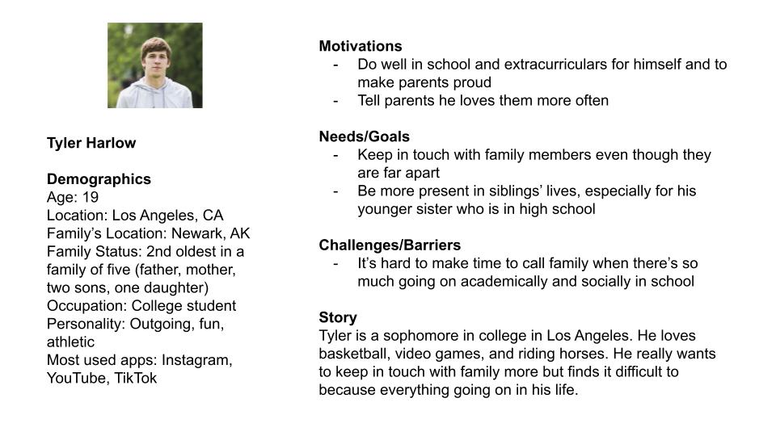

# Assignment 4: Persona + Scenario

## The purpose of UX storytelling

- It helps communicate to the audience of the app in a way to help them see how the app can benefit them and how it fits their needs
- It helps identify users' problems and empathetically see things from their perspective in regards to the app
- It helps you understand your users better from their perspective on things
- It helps you focus on behaviors and motivations while filtering out things such as personal biases in designing the app
- Ultimately it helps you think through and understand users a lot better so you can design an app with the users' best interest in mind

For this assignment, I will try to do is to develop two user personas with empathy maps and two scenarios with journey maps. The personas will be doing one of the following two tasks: share with a family member that they are grateful for them and share a core memory with a family member. 

## Personas & Empathy Maps

### Persona 1:

Assignments/tyler_persona.jpg
### Persona 2:

## User Scenarios & Journey Maps
