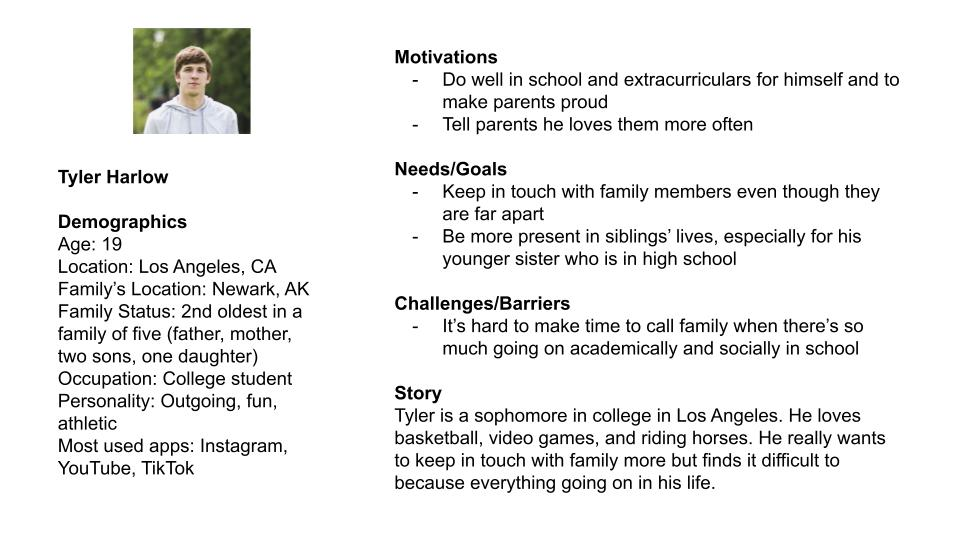

# Halo 
## Jonathan King

### Introduction: a brief information about the project. 
What is the project about? The motivation of the project and possible contribution.

### Clear design statement: 
What is the issue and Why do you think it is important to resolve that issue by your project? 

### Competitor analysis [assignment01 & 02]: 
Summary and link to the heuristics and usability testing of the *existing* product(s) - or the *original* website you evaluated

### User research [contextual inquiry, assignment04]: 
Summary and link to your assignment folder

### UX storytelling [persona+scenario, assignment05] 
Summary and link to your assignment folder

### Wireframe and graphic design element variation [assignment06 + part of 07]

### Low-fidelity prototype (wireflow, assignment06) 
Summary and link to the sketches (may contains the multiple versions and evaluation history)

### High-fidelity prototype (functional/interactive prototype, assignment08) 
Summary statement and link to or an embedded prototype

### Optional evaluation and revision history 
Including cognitive walkthrough; impression test, accessibility audit, usability testing), per each summary and link to the notes (when you share the video or other detailed evidences, I will notify you when you can make the contents private as soon as your work is graded)

### Pitch video 

<!-- blank line-->
<figure class="video_container">
  <iframe src="https://youtu.be/s4mXxflAjps" frameborder="0"
          allowfullscreen="true"></iframe>
  </figure>
<!-- blank line-->

### Conclusion: what did you learn throughout the process?

# below is old stuff pls ignore

# Digital Humanities 110: User Interface and Design

## LeBond: Connecting with Family through Shared Hobbies 

### by Jonathan King

Almost every family has something they like to bond over - some families love watching sports together, some families love to cook together, and some families love to watch TV shows together. However, as families get larger through the generations and children grow up and move to different places throughout the world, the distance keeps families from being able to bond over shared hobbies and activities as frequently. LeBond is a new app that seeks to address this by providing a digital app in which family members can still bond over their family hobbies. LeBond offers features such as post threads in which families can live chat or live react to events like sports games, short video feeds in which family members can share clips of them doing activities like cooking and hiking, tournament brackets in which families can organize tournaments for online activities like chess, and a "flex board" where family members can show off and celebrate the most proud accomplishments of their life (for example birthing a kid). 

